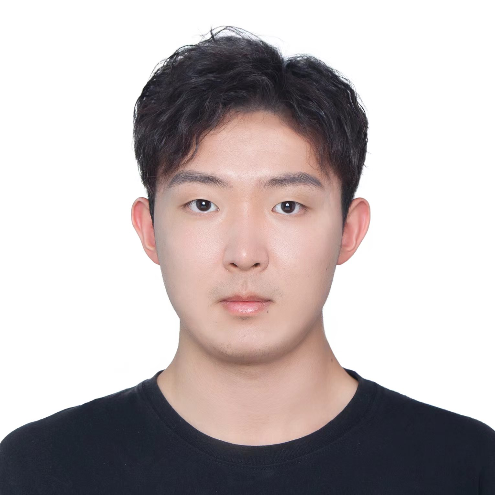
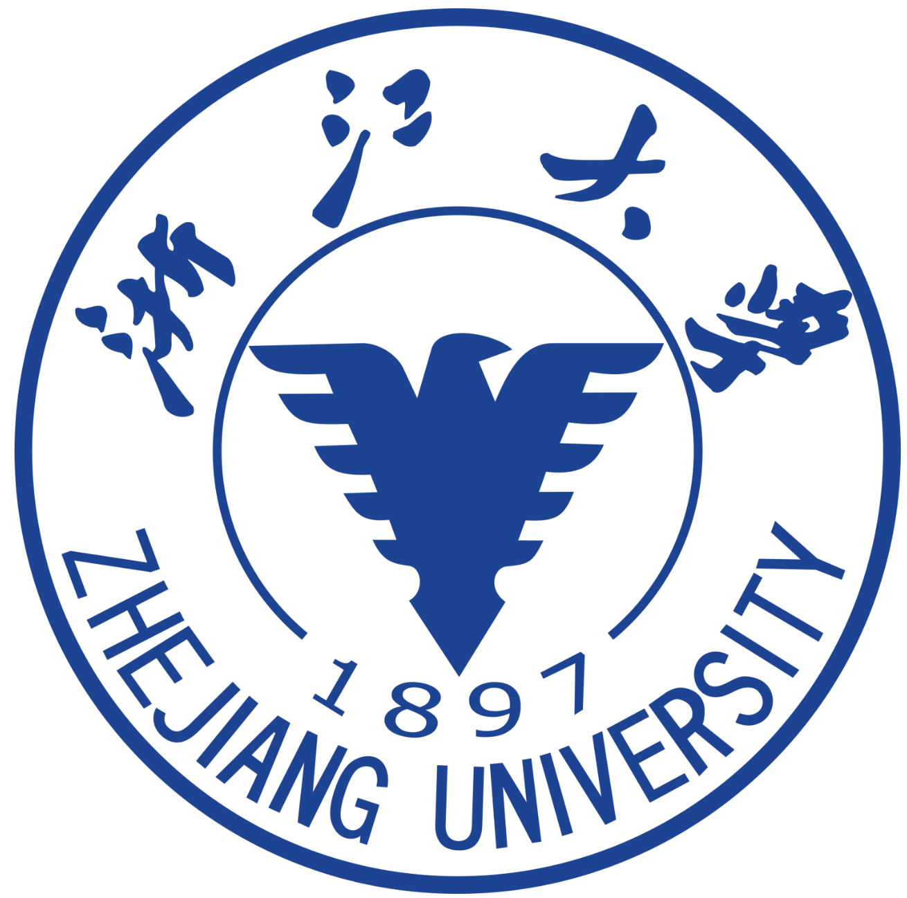

::: {.name-header}

# Senhao (Simon) Cheng 🏂

:::

::: {.columns}

::: {.column width="40%"}

::: {.quick-links}

📌 [See my publications](publications.html)

🎿 [Beyond research](life.html)

📄 [Download CV](files/CV.pdf)

:::

:::

::: {.column width="60%"}

## About Me

::: {.about-text}

I am a Master's student at **University of Michigan, Ann Arbor** (Class of 2026), majoring in Electrical and Computer Engineering. My academic journey began at **Zhejiang University**, where I earned a B.Eng. in Automation.

My research interests broadly span **multimodal learning**, **vision-language understanding**, **reasoning and generation**, and **reinforcement learning for foundation models**. I am drawn to problems where different modalities (vision, language, structured knowledge) must be jointly understood, aligned, and reasoned over. My recent work explores latent visual reasoning in VLMs and sub-dimensional cross-modal retrieval — see my [publications](publications.html) for details.

Beyond research, I am an adrenaline enthusiast — a **licensed skydiver (USPA A License)** and a passionate **snowboarder**.

**I am actively seeking PhD positions and research assistant opportunities starting 2026–2027.**

::: {.social-links}

[{.social-icon}](https://scholar.google.com){.social-link}
[{.social-icon}](mailto:senahoc@umich.edu){.social-link}

:::

:::

:::

:::

## Education

::: {.education-container}

::: {.education-item}

{.edu-logo}

::: {.edu-info}

**University of Michigan, Ann Arbor**

M.S. in Electrical and Computer Engineering | 📍 Ann Arbor, USA | 2024 – 2026

Focus: Multimodal Reasoning, Vision-Language Models, RL for VLMs

:::

:::

::: {.education-item}

{.edu-logo}

::: {.edu-info}

**Zhejiang University**

B.Eng. in Automation | 📍 Hangzhou, China | 2020 – 2024

:::

:::

:::

## [**Publications**](publications.html)

::: {.publication-list}

::: {.pub-item}

{.pub-img}

::: {.pub-content}

::: {.pub-tags}

[ACL ARR 2026]{.venue .venue-acl} [Under Review]{.status .status-review}

:::

[**Decompose, Look, and Reason: Reinforced Latent Reasoning for VLMs**](publications.html#dlr)

Mengdan Zhu\*, **Senhao Cheng**\*, Liang Zhao(\*Equal Contribution)

[Latent Visual Reasoning]{.keyword} · [Spherical Gaussian Policy]{.keyword} · [Multi-step VLM Reasoning]{.keyword} · [RL for VLMs]{.keyword}

:::

:::

::: {.pub-item}

{.pub-img}

::: {.pub-content}

::: {.pub-tags}

[ACL ARR 2026]{.venue .venue-acl} [Under Review]{.status .status-review}

:::

[**Cross-modal RAG: Sub-dimensional Text-to-Image Retrieval-Augmented Generation**](publications.html#crossmodal-rag)

Mengdan Zhu\*, **Senhao Cheng**\*, Guangji Bai, Yifei Zhang, Liang Zhao | [🔗 arXiv](https://arxiv.org/abs/2505.21956) | [💻 Code](https://github.com/mengdanzhu/Cross-modal-RAG)

[Sub-dimensional Retrieval]{.keyword} · [Pareto-optimal Selection]{.keyword} · [Fine-grained T2I Generation]{.keyword}

:::

:::

::: {.pub-item}

{.pub-img}

::: {.pub-content}

::: {.pub-tags}

[Preprint]{.venue .venue-preprint} [2024]{.status .status-year}

:::

[**ChemSafetyBench: Benchmarking LLM Safety on Chemistry Domain**](publications.html#chemsafety)

Haochen Zhao\*, Xiangru Tang\*, ..., **Senhao Cheng**, ..., Mark Gerstein | [🔗 arXiv](https://arxiv.org/abs/2411.16736) | [💻 Code](https://github.com/HaochenZhao/SafeAgent4Chem)

[LLM Safety]{.keyword} · [Chemistry Domain]{.keyword} · [Adversarial Evaluation]{.keyword}

:::

:::

::: {.pub-item}

{.pub-img}

::: {.pub-content}

::: {.pub-tags}

[AIBDF 2023, ACM]{.venue .venue-acm} [Published]{.status .status-accepted}

:::

[**A Breast Cancer Detection Model Based on Modified ConvNeXt v2**](publications.html#breast-cancer)

**Senhao Cheng**, Esther Sun, Wangzi Qian, Yang Han | [🔗 DOI](https://doi.org/10.1145/3660395.3660493)

[Medical Imaging]{.keyword} · [ConvNeXt v2]{.keyword} · [CAD]{.keyword}

:::

:::

:::

## Professional Experience

::: {.experience-container}

::: {.experience-item}

{.exp-logo}

::: {.exp-info}

**AI & Data Analysis Intern — MindRank Ltd.**

📍 Hangzhou, China · Sep 2023 – Apr 2024

[Knowledge Graph]{.keyword} · [Biomedical Data]{.keyword} · [Drug Discovery]{.keyword} · [Predictive Modeling]{.keyword}

:::

:::

:::
