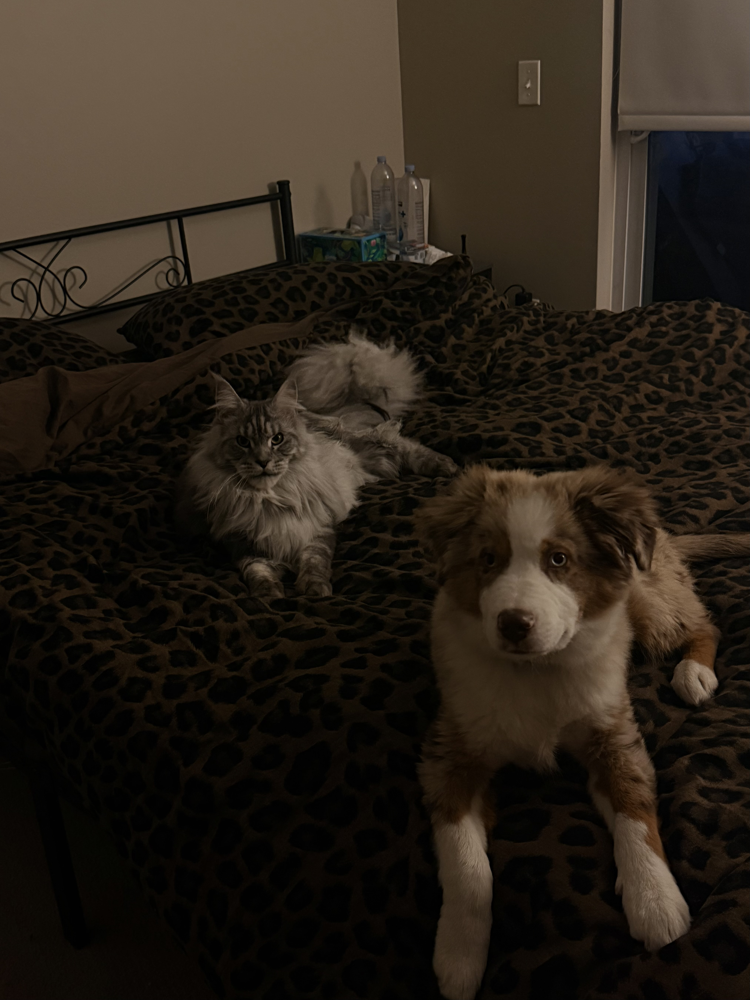
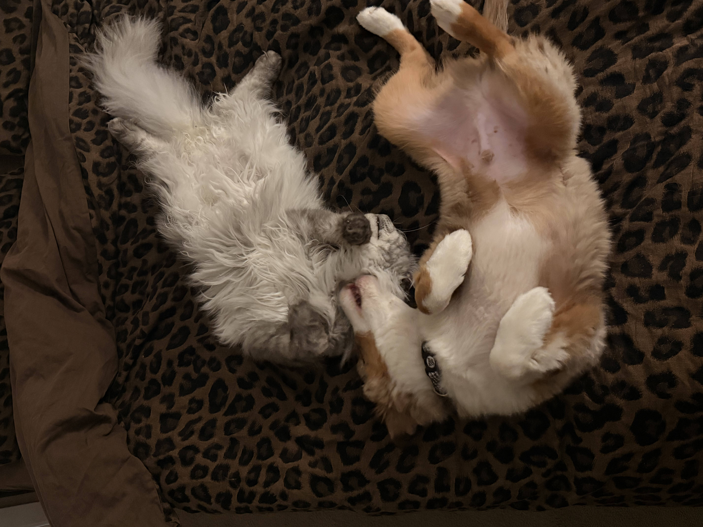
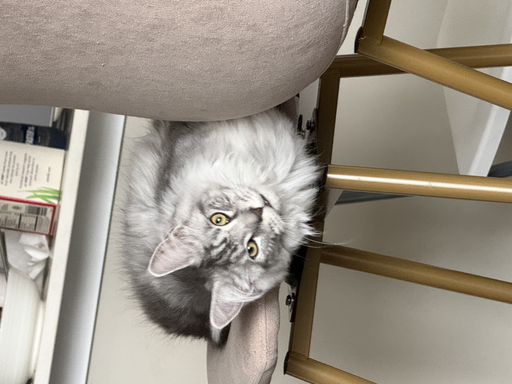
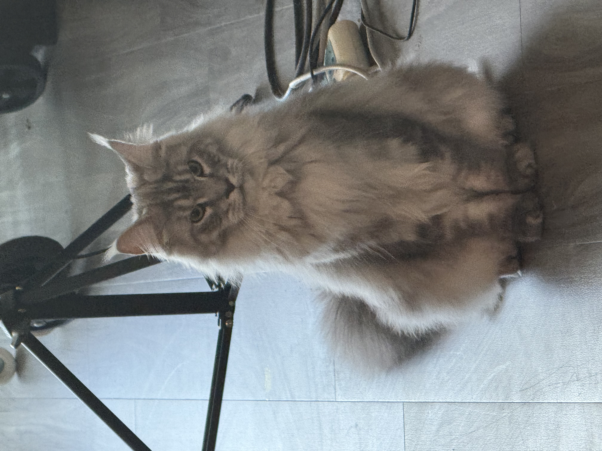
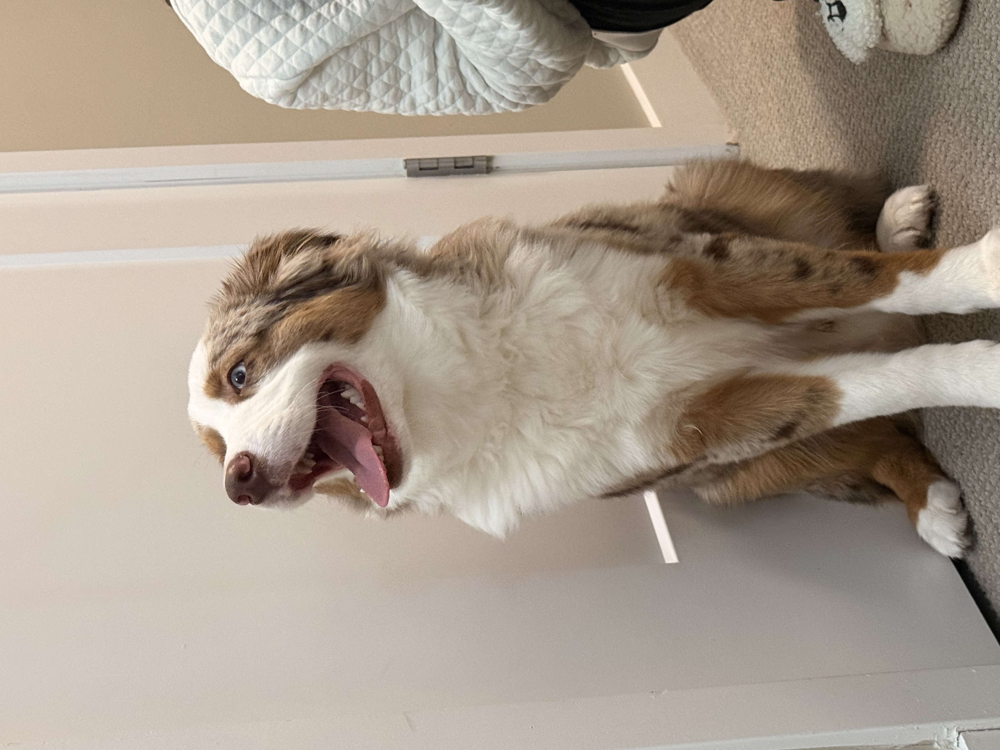
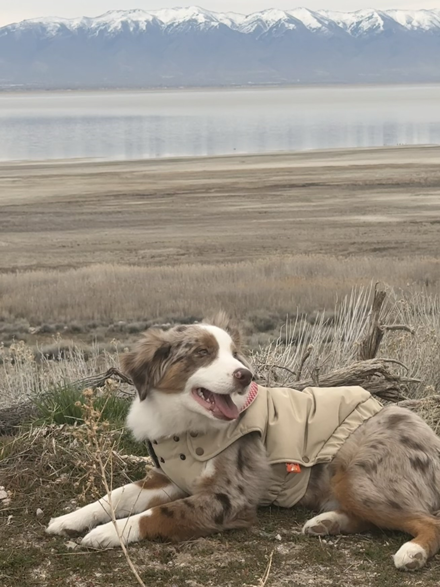

🪂
<h2 class="life-section-title">Skydiving — USPA A License</h2>

I hold a <strong>USPA A License</strong> for solo skydiving. 

🏂
<h2 class="life-section-title">Snowboarding</h2>

Snowboarding is my winter obsession. From carving groomers to exploring tree runs, I love the flow state that comes with reading terrain and reacting in real time.

<video controls width="100%">
<source src="photos/snowboard.MP4" type="video/mp4">
</video>

🐾
<h2 class="life-section-title">My Companions</h2>

Meet my two best friends: <strong>八戒 (Bobby)</strong> the Australian Shepherd and <strong>狗蛋儿 (Golden)</strong> the Maine Coon.

