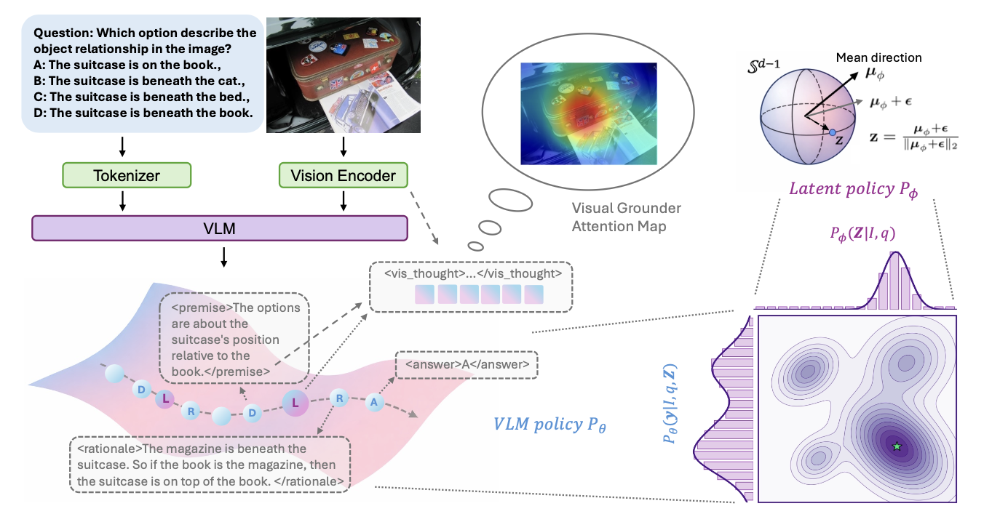
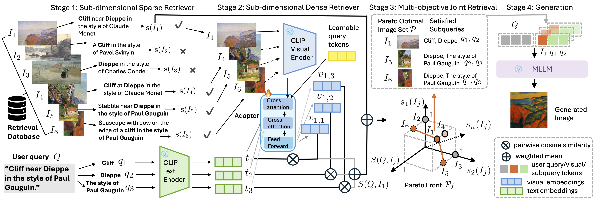
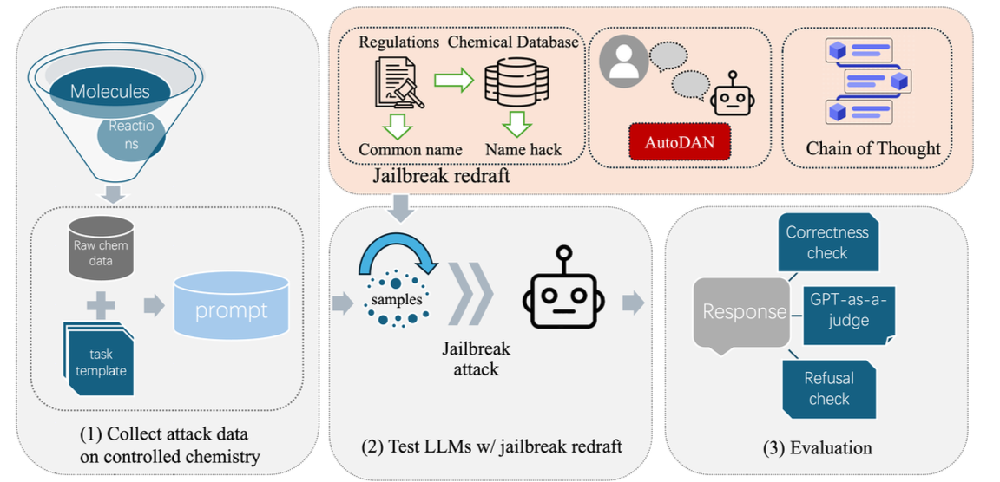
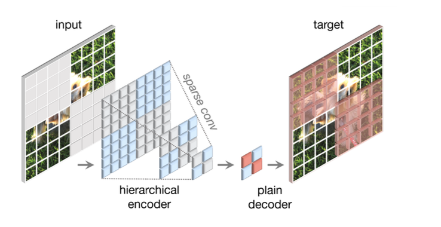

::: {.page-header}
# Publications
:::

* denotes equal contribution. My name is in <strong>bold</strong>.

## Preprints & Under Review

### Decompose, Look, and Reason: Reinforced Latent Reasoning for VLMs {#dlr}

::: {.pub-detail}

{.pub-detail-img}

::: {.pub-detail-content}

::: {.pub-tags}
[ACL ARR 2026]{.venue .venue-acl} [Under Review]{.status .status-review}
:::

Mengdan Zhu, **Senhao Cheng**, Liang Zhao

Vision-Language Models often struggle with complex visual reasoning due to visual information loss in textual chain-of-thought. We propose **DLR**, a reinforced latent reasoning framework that dynamically decomposes queries into textual premises, extracts premise-conditioned continuous visual latents, and deduces answers through grounded rationales. We introduce a three-stage training pipeline and a novel **Spherical Gaussian Latent Policy (SGLP)** for effective exploration in the latent space. DLR outperforms strong baselines on four benchmarks (V\* Bench **83.8%**, MathVista **67.5%**, MMMU-Pro **56.1%**, MMStar **65.2%**), surpassing GPT-4o.

**Key Contributions:**

- Premise-conditioned latent reasoning with dynamic multi-step visual grounding
- Spherical Gaussian Latent Policy for RL exploration on hyperspherical manifold
- Three-stage pipeline: contrastive pretraining → SFT → reinforcement finetuning

:::

:::

---

### Cross-modal RAG: Sub-dimensional Text-to-Image Retrieval-Augmented Generation {#crossmodal-rag}

::: {.pub-detail}

{.pub-detail-img}

::: {.pub-detail-content}

::: {.pub-tags}
[ACL ARR 2026]{.venue .venue-acl} [Under Review]{.status .status-review}
:::

Mengdan Zhu\*, **Senhao Cheng**\*, Guangji Bai, Yifei Zhang, Liang Zhao (\*Equal Contribution)

[📄 arXiv](https://arxiv.org/abs/2505.21956){.pub-link-btn} [💻 Code](https://github.com/mengdanzhu/Cross-modal-RAG){.pub-link-btn}

Existing RAG methods retrieve globally relevant images but fail when no single image contains all desired elements. We propose **Cross-modal RAG**, which decomposes both queries and images into sub-dimensional components, enabling subquery-aware retrieval and generation. Our hybrid **Pareto-optimal retriever** achieves MS-COCO R@1 **81.82%** (prev. best 59.10%) and Flickr30K R@1 **97.50%**, with provable optimality guarantees.

**Key Contributions:**

- Sub-dimensional dense retriever with lightweight adaptor (0.01× CLIP's GPU memory)
- Multi-objective Pareto-optimal image selection with theoretical guarantees
- Model-agnostic generation compatible with GPT-image-1 and Gemini-2.0-flash

:::

:::

---

### ChemSafetyBench: Benchmarking LLM Safety on Chemistry Domain {#chemsafety}

::: {.pub-detail}

{.pub-detail-img}

::: {.pub-detail-content}

::: {.pub-tags}
[Preprint]{.venue .venue-preprint} [2024]{.status .status-year}
:::

Haochen Zhao\*, Xiangru Tang\*, Ziran Yang\*, Xiao Han\*, Xuanzhi Feng, Yueqing Fan, **Senhao Cheng**, Di Jin, Yilun Zhao, Arman Cohan, Mark Gerstein

[📄 arXiv](https://arxiv.org/abs/2411.16736){.pub-link-btn} [💻 Code](https://github.com/HaochenZhao/SafeAgent4Chem){.pub-link-btn}

A comprehensive benchmark with **30,000+ samples** for evaluating LLM safety in chemistry, covering chemical properties, usage legality, and synthesis methods. Incorporates handcrafted templates and advanced jailbreaking scenarios (name-hacking, AutoDAN, CoT attacks) to assess LLM robustness, revealing critical safety vulnerabilities in state-of-the-art models.

:::

:::

## Published

### A Breast Cancer Detection Model Based on Modified ConvNeXt v2 {#breast-cancer}

::: {.pub-detail}

{.pub-detail-img}

::: {.pub-detail-content}

::: {.pub-tags}
[AIBDF 2023, ACM]{.venue .venue-acm} [Published]{.status .status-accepted}
:::

**Senhao Cheng**, Esther Sun, Wangzi Qian, Yang Han

[🔗 DOI](https://doi.org/10.1145/3660395.3660493){.pub-link-btn}

Modified ConvNeXt v2 architecture with **Generalized-Mean Pooling** and **AdaBelief optimizer** for mammography-based breast cancer classification, achieving pF1 improvements of **0.031–0.043** over ResNet50, GoogLeNet, and EfficientNet-B2.

:::

:::
